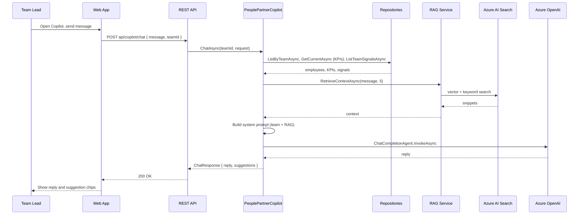
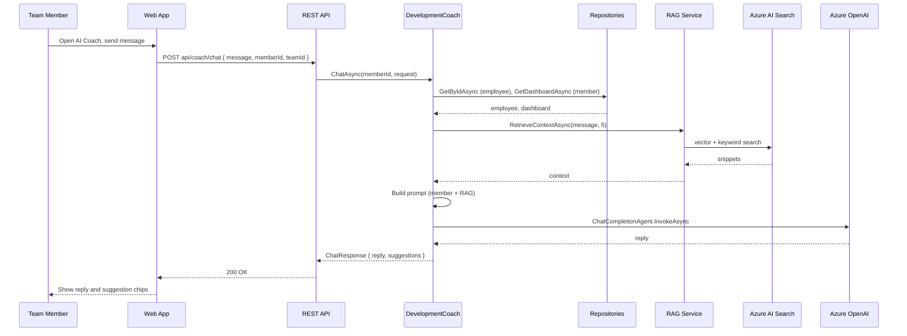
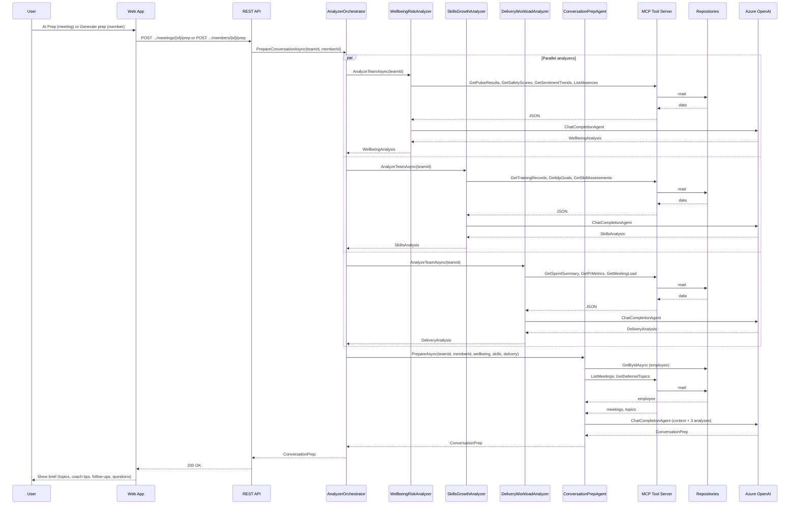

# LogIQ

[](https://aka.ms/aidevdayshackathon)

LogIQ is an AI-powered people and team intelligence platform built for the [AI Dev Days Hackathon](https://github.com/Azure/AI-Dev-Days-Hackathon). It helps team leads and people partners understand team health, wellbeing risk, skills gaps, and delivery load, and it helps individual contributors prepare for 1:1s and growth conversations. The system uses a multi-agent pipeline backed by MCP (Model Context Protocol) tools, Azure OpenAI (chat and embedding models), and Azure AI Search for RAG.

---

## Solution Overview

**Problem:** Team leads and people partners need a single place to see team health, risks, and readiness for 1:1s. Team members need support preparing for conversations and growth without switching tools.

**What LogIQ does:**

- **Team view:** Dashboard with employees, wellbeing/skills/delivery KPIs, signals, and financials. Wellbeing risks and 1:1 planner with meetings and deferred topics.
- **Member view:** Per-member detail (profile, skills, signals), dashboard (KPIs, dev goals, prep topics, coach tips), and delivery/skills tabs.
- **AI Copilot (lead):** Chat over team context plus RAG over HR/people knowledge. Uses employees, KPIs, signals, and retrieved snippets to answer questions and suggest actions.
- **AI Coach (member):** Chat over individual context and RAG for career and 1:1 prep. Uses employee profile and member dashboard plus retrieved knowledge.
- **Conversation prep pipeline:** Orchestrator runs three analyzers in parallel (wellbeing, skills, delivery), then a conversation prep agent that consumes their outputs and produces a 1:1 brief (suggested topics, follow-ups, coach tips). Prep is triggered from the 1:1 Planner (AI Prep button on meeting detail) and from the 1:1 Prep page (Generate prep button).

## Technology Stack

| Component           | Technology                                       |
| ------------------- | ------------------------------------------------ |
| Backend             | C#, .NET 10 SDK, ASP.NET Core 10                 |
| Frontend            | React, Vite, Fluent UI, TanStack Query           |
| Storage             | Azure Table Storage                              |
| LLM                 | Azure Foundry, Azure OpenAI                      |
| Models              | gpt-4o + text-embedding-3-small                  |
| RAG                 | Azure AI Search                                  |
| MCP                 | ModelContextProtocol C# SDK                      |
| Agent Orchestration | Microsoft Semantic Kernel                        |
| Agent Communication | A2A via shared POCO contracts                    |
| API Documentaion    | Scalar (OpenAPI)                                 |
| DevOps              | GitHub Actions, Docker, Azure Container Registry |
| Deployment          | Azure Container App (CORS, Custom Domain)        |

## Architecture Overview (C4)

### C4 Level 1 — System Context

**Actors**, the **LogIQ system**, and **external systems**.

```
     ┌─────────────────┐              ┌─────────────────┐
     │   Team Lead     │              │  Team Member    │
     │ (People Partner)│              │ (IC / Employee) │
     └────────┬────────┘              └────────┬────────┘
              │ uses                           │ uses
              └──────────────┬─────────────────┘
                             ▼
              ┌──────────────────────────────────────────┐
              │              LogIQ                        │
              │  AI-powered people & team intelligence   │
              │  Dashboard, 1:1 planner, prep, copilot, │
              │  coach, wellbeing/skills/delivery       │
              └──────────────┬───────────────────────────┘
         ┌───────────────────┼───────────────────┐
         │ uses              │ uses              │ uses
         ▼                   ▼                   ▼
┌─────────────────┐ ┌─────────────────┐ ┌─────────────────┐
│ Azure OpenAI    │ │ Azure AI Search  │ │ Azure Table      │
│ (chat + embed)  │ │ (RAG: vector +   │ │ Storage          │
│                 │ │  keyword)        │ │ (6 tables)       │
└─────────────────┘ └─────────────────┘ └─────────────────┘
         ▲
         │ uses (optional)
┌─────────────────┐
│ External MCP    │
│ Client (POST    │
│ /mcp)           │
└─────────────────┘
```

### C4 Level 2 — Container Diagram (Backend in Detail)

Containers **inside** LogIQ and how the backend is structured.

```
     ┌─────────────────┐              ┌─────────────────┐
     │   Team Lead     │              │  Team Member    │
     └────────┬────────┘              └────────┬────────┘
              └──────────────┬─────────────────┘
                             ▼
┌─────────────────────────────────────────────────────────────────────────────┐
│                              LogIQ System                                    │
│  ┌─────────────────────────────────────┐  ┌─────────────────────────────┐  │
│  │  Web Application                     │  │  Backend API                  │  │
│  │  (React, Fluent UI, Vite)           │  │  (ASP.NET Core 10)          │  │
│  │  Dashboard, My Team, Wellbeing,      │──│  REST: teams, members,       │  │
│  │  1:1 Planner, Member Detail,       │  │  meetings, prep, copilot,    │  │
│  │  Skills, Delivery, Prep, Dev Plan,  │  │  coach; MCP server at /mcp   │  │
│  │  Signals, Copilot, AI Coach         │  │                              │  │
│  └─────────────────────────────────────┘  └──────────────┬──────────────┘  │
│           HTTP (REST API)                                 │                  │
└───────────────────────────────────────────────────────────│──────────────────┘
                                                            │
                    Backend API — internal containers        │
                    ─────────────────────────────────────────
        ┌─────────────────────┼─────────────────────┐
        ▼                     ▼                     ▼
┌───────────────┐   ┌─────────────────────┐   ┌─────────────────────┐
│ REST API      │   │ Analyzer Orchestrator│   │ Copilot & Coach     │
│ (Controllers) │   │ (Semantic Kernel)    │   │ (PeoplePartner +    │
│ Teams,        │   │ WellbeingRisk,       │   │  DevelopmentCoach)  │
│ Members,      │   │ SkillsGrowth,        │   │ RAG + repos,        │
│ Meetings,     │   │ DeliveryWorkload,    │   │ Azure OpenAI chat   │
│ Prep, Chat    │   │ ConversationPrep     │   └──────────┬──────────┘
└───────┬───────┘   └──────────┬──────────┘              │
        │                      │                         │
        │                      ▼                         │
        │              ┌─────────────────────┐           │
        │              │ MCP Tool Server     │           │
        │              │ (in-process; /mcp)  │           │
        │              │ WellbeingSignals,   │           │
        │              │ HrDataGateway,     │           │
        │              │ LearningSkills,    │           │
        │              │ DeliveryMetrics     │           │
        │              └──────────┬──────────┘           │
        │                         │                      │
        └─────────────────────────┼──────────────────────┘
                                  ▼
                       ┌─────────────────────┐
                       │ Repositories        │
                       │ (Storage layer)     │
                       │ Employee, Signal,   │
                       │ Meeting, TeamKpi,   │
                       │ Member (6 tables)   │
                       └──────────┬──────────┘
                                  │
         ┌────────────────────────┼────────────────────────┐
         ▼                        ▼                        ▼
┌─────────────────┐      ┌─────────────────┐      ┌─────────────────┐
│ Azure Table     │      │ Azure AI Search │      │ Azure OpenAI    │
│ Storage         │      │ (RAG, vector)   │      │ (chat + embed)   │
└─────────────────┘      └─────────────────┘      └─────────────────┘
```

- **Web Application** talks only to the REST API. **Controllers** use repositories for CRUD and invoke agents for chat and prep. **Agents** use MCP tool classes (same code as at `/mcp`) and/or repositories + RAG.
- Details: [api/SYSTEM_ARCHITECTURE.md](api/SYSTEM_ARCHITECTURE.md), [api/README.md](api/README.md).

> All data comes from the backend. Repositories read from Azure Table Storage; agents use the same MCP tool implementations exposed at `/mcp` for external clients.

---

## Flow sequence diagrams (Mermaid)

Mermaid **sequence diagrams** for the main flows: Copilot (lead), Coach (member), and Conversation prep.

### Copilot (lead) — team context + RAG



### Coach (member) — member context + RAG



### Conversation prep — orchestrated analyzers + MCP



---

## Agent Pipeline

### Layer 1 — MCP Servers (C# SDK)

Four `[McpServerToolType]` classes expose Azure Table Storage data as MCP tools:

| Server                  | Key Tools                                                                           |
| ----------------------- | ----------------------------------------------------------------------------------- |
| `HrDataGatewayTools`    | `GetEmployeeProfile`, `ListTeamEmployees`, `ListMeetings`, `GetDeferredTopics`      |
| `DeliveryMetricsTools`  | `GetSprintSummary`, `GetPrMetrics`, `GetMeetingLoad`                                |
| `LearningSkillsTools`   | `GetTrainingRecords`, `GetIdpGoals`, `GetSkillAssessments`, `GetMemberSkillProfile` |
| `WellbeingSignalsTools` | `GetPulseResults`, `GetSafetyScores`, `GetTeamSignals`, `GetSentimentTrends`        |

### Layer 2 — Analyzer Agents (Semantic Kernel)

Three `ChatCompletionAgent` instances run in parallel via `Task.WhenAll`:

- **WellbeingRiskAnalyzer** — detects burnout, sick-leave spikes, psych-safety drops → `WellbeingAnalysis`
- **SkillsGrowthAnalyzer** — maps skill gaps, IDP progress, learning debt → `SkillsAnalysis`
- **DeliveryWorkloadAnalyzer** — flags sprint anomalies, PR velocity drops, overload → `DeliveryAnalysis`

### Layer 3 — Conversation Prep Agent (A2A)

Receives all three `*Analysis` records via Agent-to-Agent pattern, combines with HR context, and generates `ConversationPrep` with:

- Suggested 1:1 topics ranked by urgency
- Follow-up actions from previous meetings
- Coach tips and empathetic questions
- Context summary for the lead

### Layer 4 — Role-Specific Copilots

- **PeoplePartnerCopilot** (Team Lead) — RAG via Azure AI Search, team-wide context, proactive recommendations
- **DevelopmentCoach** (Team Member) — private coaching with individual employee context, career guidance

---

## Data and storage

**Azure Table Storage** (six tables, see `StorageOptions` / appsettings):

| Repository         | Tables                             | Purpose                                                      |
| ------------------ | ---------------------------------- | ------------------------------------------------------------ |
| EmployeeRepository | EmployeesTable                     | Team members, KPIs, churn risk, meeting load, etc.           |
| SignalRepository   | SignalsTable                       | Team and member signals (wellbeing, delivery, recognition).  |
| MeetingRepository  | MeetingsTable, DeferredTopicsTable | 1:1 meetings and deferred topics.                            |
| TeamKpiRepository  | TeamKpiSnapshotsTable              | Team KPIs and financials (at-risk count, churn exposure).    |
| MemberRepository   | AnalysisResultsTable               | Member detail, dashboard, and skills matrix as stored blobs. |

Seed data: on first run, if storage is empty, `SeedDataService` seeds employees (e.g. 2–10), signals, meetings, KPIs, skills matrix, and member detail/dashboard. MembersController can synthesize a dashboard when none is stored.

**Entities** (domain models): Employee, Signal, MemberSignal, Meeting, DeferredTopic, TeamKpis, TeamFinancials, SkillsMatrix, MemberDetail, MemberDashboard, ConversationPrep. See SYSTEM_ARCHITECTURE.md for field-level descriptions.

---

## Agents and orchestration

### Analyzer layer (MCP-driven)

Three analyzer agents run in parallel via `AnalyzerOrchestrator`:

| Agent                        | Role                                          | Data (MCP tools)                                              | Output                                            |
| ---------------------------- | --------------------------------------------- | ------------------------------------------------------------- | ------------------------------------------------- |
| **WellbeingRiskAnalyzer**    | Burnout, psych-safety, sick leave, engagement | WellbeingSignalsTools, HrDataGatewayTools (e.g. ListAbsences) | WellbeingAnalysis; persists high/critical signals |
| **SkillsGrowthAnalyzer**     | Skill gaps, IDP progress, learning            | LearningSkillsTools                                           | SkillsAnalysis                                    |
| **DeliveryWorkloadAnalyzer** | Sprint/PR/meeting load, overload              | DeliveryMetricsTools                                          | DeliveryAnalysis; persists workload signals       |

Each uses Semantic Kernel `ChatCompletionAgent` and calls MCP tool classes in process; tools read from repositories and return JSON.

### Conversation prep (A2A-style)

**ConversationPrepAgent** receives the three analysis results from the orchestrator, plus meetings and deferred topics from HrDataGatewayTools and employee/dashboard from repositories. It produces **ConversationPrep**: suggested 1:1 topics, follow-up actions, coach tips, questions to ask, and context summary. This pipeline is triggered by `POST api/teams/{teamId}/meetings/{meetingId}/prep` or `POST api/members/{memberId}/prep` (Triggered from AI Prep in 1:1 Planner; Generate prep on 1:1 Prep page).

### Role-specific copilots

| Agent                    | Audience                   | Data                                                         | AI                              |
| ------------------------ | -------------------------- | ------------------------------------------------------------ | ------------------------------- |
| **PeoplePartnerCopilot** | Team lead / people partner | EmployeeRepository, TeamKpiRepository, SignalRepository, RAG | Azure OpenAI chat + RAG context |
| **DevelopmentCoach**     | Team member                | EmployeeRepository, MemberRepository, RAG                    | Azure OpenAI chat + RAG context |

Both use repositories and `IRagService` directly (no MCP in the chat path). They build a system prompt from loaded context and RAG snippets, then call the same Azure OpenAI chat deployment.

---

## MCP (Model Context Protocol)

Four tool classes implement the data surface used by the analyzer and prep agents and are exposed as an MCP server for external clients:

| Tool class                | Example methods                                                                        | Consumed by                                  |
| ------------------------- | -------------------------------------------------------------------------------------- | -------------------------------------------- |
| **WellbeingSignalsTools** | GetPulseResults, GetSafetyScores, GetTeamSignals, GetSentimentTrends, GetMemberSignals | WellbeingRiskAnalyzer                        |
| **HrDataGatewayTools**    | GetEmployeeProfile, ListTeamEmployees, ListAbsences, ListMeetings, GetDeferredTopics   | WellbeingRiskAnalyzer, ConversationPrepAgent |
| **LearningSkillsTools**   | GetTrainingRecords, GetIdpGoals, GetSkillAssessments, GetMemberSkillProfile            | SkillsGrowthAnalyzer                         |
| **DeliveryMetricsTools**  | GetSprintSummary, GetPrMetrics, GetMeetingLoad                                         | DeliveryWorkloadAnalyzer                     |

- **In-process:** Agents inject these classes and call them directly (no MCP wire hop inside the API).
- **MCP server:** Same tools are exposed at **POST /mcp** so external MCP clients can call them over the protocol.

Configuration: `Mcp:BaseUrl` (e.g. `http://localhost:5000`). See SYSTEM_ARCHITECTURE.md for full endpoint and flow tables.

---

## RAG (retrieval-augmented generation)

**Index:** Azure AI Search index (e.g. `logiq-knowledge`) with fields `id`, `title`, `content`, and a vector field `contentVector`. Created and seeded at startup by `SearchIndexProvisioningService`.

**Ingest:** Seed HR documents (e.g. 1:1 best practices, churn mitigation, psychological safety, IDP, burnout, career conversations, feedback, difficult conversations) are embedded with **Azure OpenAI embeddings** (e.g. text-embedding-3-small). Embeddings are produced by `IEmbeddingService`; each document’s title and content are concatenated, embedded, and stored in `contentVector`. Provisioning uploads keyword-only documents first so the index is always populated; then, if the index has a vector profile, a second merge adds vectors.

**Retrieval:** `IRagService.RetrieveContextAsync(query, maxResults)`:

1. Gets query embedding via `IEmbeddingService.GetEmbeddingAsync(query)`.
2. If an embedding is returned, runs **vector search** on `contentVector` (Azure AI Search vector query).
3. If no embedding (e.g. Azure OpenAI not configured) or vector search returns no hits, falls back to **keyword search**.

Copilot and Coach pass the retrieved context into the LLM system prompt so answers are grounded in HR/people knowledge. Configuration: `Azure:Search` (Endpoint, ApiKey, IndexName, VectorFieldName, VectorSearchDimensions) and `Azure:OpenAI:EmbeddingDeploymentName`.

---

## AI stack (Azure OpenAI and Azure AI Search)

**Azure OpenAI** is used with two deployments (two “models” in the stack):

| Deployment                                  | Use                                             | Config key                             |
| ------------------------------------------- | ----------------------------------------------- | -------------------------------------- |
| **Chat** (e.g. gpt-4o)                      | Copilot, Coach, all analyzers, ConversationPrep | `Azure:OpenAI:ChatDeploymentName`      |
| **Embedding** (e.g. text-embedding-3-small) | RAG indexing and query embedding                | `Azure:OpenAI:EmbeddingDeploymentName` |

Configuration also includes `Azure:OpenAI:Endpoint` and `Azure:OpenAI:ApiKey`. The backend uses Microsoft Semantic Kernel for chat completion and the Azure OpenAI SDK for embeddings. The solution is built to run on Azure and fits into an enterprise AI setup (e.g. Microsoft Foundry) where Azure OpenAI and Azure AI Search are the core services.

**Azure AI Search** provides the RAG index: keyword and vector search, HNSW vector profile, and optional semantic behavior as above.

---

## Flows (web to API to agent)

**Copilot (lead):** User opens Copilot from the FAB, sends a message. Frontend calls `POST api/copilot/chat` with message and teamId. CopilotController calls PeoplePartnerCopilot, which loads employees, KPIs, signals and RAG context, builds the system prompt, invokes the chat agent, and returns reply and suggestions.

**Coach (member):** User opens AI Coach, sends a message. Frontend calls `POST api/coach/chat` with message, memberId, teamId. CoachController calls DevelopmentCoach, which loads employee and member dashboard plus RAG context, builds the prompt, invokes the chat agent, and returns reply and suggestions.

**Conversation prep:** User clicks **AI Prep** on a meeting (1:1 Planner) or **Generate prep** (1:1 Prep page). Client calls `POST api/teams/{teamId}/meetings/{meetingId}/prep` or `POST api/members/{memberId}/prep`. Controller calls AnalyzerOrchestrator.PrepareConversationAsync. Orchestrator runs the three analyzers in parallel (each uses MCP tools), then calls ConversationPrepAgent with the three results; prep agent uses HrDataGatewayTools and repos and returns ConversationPrep. No RAG in this pipeline.

End-to-end tables for each agent and the prep pipeline are in SYSTEM_ARCHITECTURE.md (Section 10).

---

## Technology stack

| Layer           | Technology                                                          |
| --------------- | ------------------------------------------------------------------- |
| Frontend        | React 18, Vite, Fluent UI v9, TanStack Query                        |
| Backend         | ASP.NET Core 10, .NET 10                                            |
| Agent framework | Microsoft Semantic Kernel                                           |
| MCP             | ModelContextProtocol.AspNetCore (MCP server at /mcp)                |
| LLM             | Azure OpenAI (chat + embedding deployments)                         |
| RAG             | Azure AI Search (vector + keyword), IEmbeddingService + IRagService |
| Storage         | Azure Table Storage (Azure.Data.Tables)                             |
| API docs        | Scalar (OpenAPI)                                                    |
| Containers      | Docker (API + webapp); multistage builds, non-root, health checks   |

---

## CI/CD: GitHub Actions and Azure Container Registry

**Pipeline:** GitHub Actions builds and pushes Docker images to **Azure Container Registry (ACR)**. Images are suitable for deployment to **Azure Container Instances (ACI)**, Azure Container Apps, or other orchestrators.

**Workflow:** `.github/workflows/docker-build-push.yml`

- **Triggers:** Push to `main`, pull requests to `main`, and tags `v*.*.*`.
- **Jobs:** Two parallel jobs: build-and-push-api, build-and-push-webapp.
- **Steps:** Checkout, Docker Buildx, login to ACR (`secrets.REGISTRY`, `ACR_USERNAME`, `ACR_PASSWORD`), metadata (tags/labels), build-push. Push is skipped on pull requests (build-only for validation).
- **Images:** `logiq-api`, `logiq-webapp` (contexts `./api`, `./webapp`; Dockerfiles in those directories). Multi-platform: `linux/amd64`, `linux/arm64`. Caching: GitHub Actions cache.
- **Tags:** From docker/metadata-action: branch, pr, semver (e.g. 1.0.0, 1.0, 1), sha, and `latest` on default branch.

**Secrets (repository or environment):** `REGISTRY` (ACR login server, e.g. `logiqacr.azurecr.io`), `ACR_USERNAME`, `ACR_PASSWORD` (e.g. from an Azure service principal with AcrPush).

**Deploying from ACR:** After images are in ACR, deploy to Azure Container Instances (or Container Apps) by referencing the image (e.g. `logiqacr.azurecr.io/logiq-api:latest`). Use Azure CLI, portal, or a separate CD workflow to create/update ACI/ACA from the registry. Setup instructions for ACR and secrets are in [.github/SETUP.md](.github/SETUP.md) and [.github/workflows/README.md](.github/workflows/README.md).

---

## Configuration

Backend configuration is in `api/src/Logiq.Api/appsettings.json` (and environment or User Secrets). Key sections:

- **Azure:OpenAI** – Endpoint, ApiKey, ChatDeploymentName, EmbeddingDeploymentName.
- **Azure:Search** – Endpoint, ApiKey, IndexName, VectorFieldName, VectorSearchDimensions (RAG index and vector field).
- **Azure:Storage** – ConnectionString, table names (EmployeesTable, SignalsTable, MeetingsTable, DeferredTopicsTable, TeamKpiSnapshotsTable, AnalysisResultsTable).
- **Mcp** – BaseUrl (e.g. for MCP server URL).
- **Cors:AllowedOrigins** – e.g. `http://localhost:8080` for the webapp.

For RAG document ingest, Azure:Search Endpoint and ApiKey must be set; otherwise provisioning skips and the index stays empty. See api/README.md for a full example and local run instructions.

---

## Running locally

**Prerequisites:** .NET 10 SDK, Node.js (for webapp), Azure Storage (Azurite or real connection string), optional Azure OpenAI and Azure AI Search for full AI and RAG.

**Backend:**

```bash
cd api/src/Logiq.Api
dotnet run
```

API: http://localhost:5000. Scalar (OpenAPI): http://localhost:5000/scalar. MCP: http://localhost:5000/mcp. Seed data and RAG index are provisioned on first run when configured.

**Frontend:**

```bash
cd webapp
npm install
npm run dev
```

App: http://localhost:8080. Set `VITE_API_BASE_URL=http://localhost:5000` (e.g. in `.env.local`) to point to the API.

**Docker:** See [docker/README.md](docker/README.md) for Docker Compose (API, webapp, Azurite), env vars, and production notes.

---

## Project structure

```
logiq/
├── api/                          # Backend
│   ├── src/Logiq.Api/            # ASP.NET Core app
│   │   ├── Agents/               # Orchestrator, analyzers, prep, copilot, coach
│   │   ├── Configuration/        # Options (Azure, Storage, Mcp)
│   │   ├── Controllers/          # Teams, Members, Meetings, Copilot, Coach, Search
│   │   ├── Mcp/                  # MCP tool classes
│   │   ├── Services/              # RAG, embedding, search provisioning, seed
│   │   ├── Storage/              # Repositories
│   │   └── Program.cs
│   ├── Dockerfile
│   ├── README.md                 # Backend and agent overview
│   └── SYSTEM_ARCHITECTURE.md    # Endpoints, entities, agents, MCP, flows, storage
├── webapp/                       # React frontend (Vite, Fluent UI v9)
├── docker/                       # Compose, .env.example
├── .github/
│   ├── workflows/                # docker-build-push.yml (ACR)
│   ├── SETUP.md                  # ACR and secrets setup
│   └── workflows/README.md       # Workflow and tagging details
└── README.md                     # This file
```

---

## Resources

- [AI Dev Days Hackathon](https://aka.ms/aidevdayshackathon)
- [Microsoft Agent Framework](https://aka.ms/agent-framework)
- [Azure MCP](https://aka.ms/azure-mcp)
- [Azure AI Search](https://learn.microsoft.com/azure/search/)
- [Azure OpenAI](https://learn.microsoft.com/azure/ai-services/openai/)
- [Semantic Kernel](https://learn.microsoft.com/semantic-kernel/)

---

_Built for the AI Dev Days Hackathon. Backend and architecture details: [api/README.md](api/README.md), [api/SYSTEM_ARCHITECTURE.md](api/SYSTEM_ARCHITECTURE.md)._
