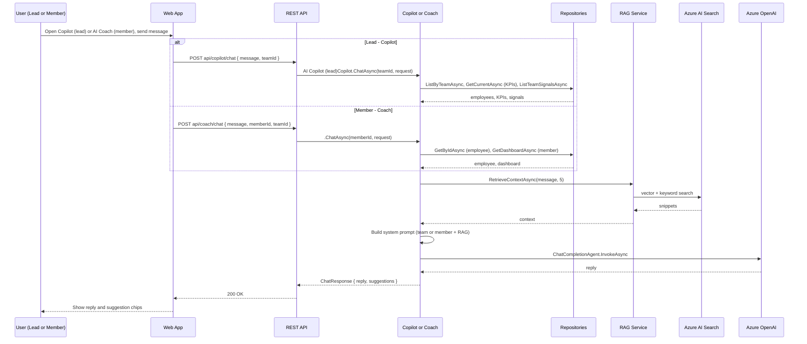
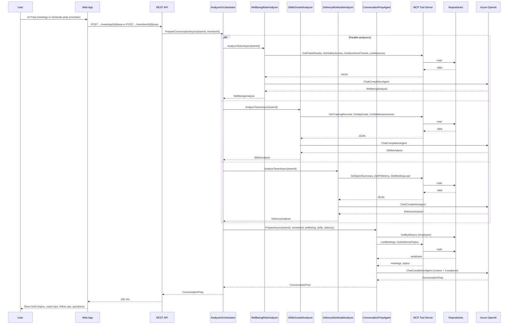

# 🧠 LogIQ

[](https://aka.ms/aidevdayshackathon)

LogIQ is an AI multi-agent system by LogiqApps that replaces the traditional People Partner / HR Business built for the [AI Dev Days Hackathon](https://github.com/Azure/AI-Dev-Days-Hackathon).Two actors served equally: Team Leads who manage teams and prepare for 1:1s, and Team
Members who own their development journey. LogIQ is proactive - it comes to you with signals, not
dashboards. The system uses a multi-agent pipeline
## Backed by

-Yes-pink "Yes")


---

## Table of contents

- [🎯 Solution Overview](#-solution-overview)
- [🛠️ Technology Stack](#️-technology-stack)
- [🏗️ Architecture Overview](#️-architecture-overview)
  - [Level 1 - System Context (HLA)](#level-1---system-context-hla)
  - [Level 2 - Container Diagram (Backend)](#level-2---container-diagram-backend)
- [📊 Flow Sequence Diagrams](#-flow-sequence-diagrams)
  - [Copilot (lead) & Coach (member) Chat with RAG](#copilot-lead--coach-member-chat-with-rag)
  - [Conversation Prep (Orchestrated Analyzers + MCP)](#conversation-prep-orchestrated-analyzers--mcp)
- [💾 Data & Storage](#-data--storage)
  - [Tables (Azure Table Storage)](#tables-azure-table-storage)
  - [Entities (Domain Models)](#entities-domain-models)
- [⚡ AI Stack (Azure OpenAI & Azure AI Search)](#-ai-stack-azure-openai--azure-ai-search)
  - [Azure OpenAI](#azure-openai)
  - [Azure AI Search](#azure-ai-search)
- [🤖 Agents](#-agents)
  - [Layer 1 - MCP Servers (C# SDK)](#layer-1---mcp-servers-c-sdk)
  - [Layer 2 - Analyzer Agents (Semantic Kernel)](#layer-2---analyzer-agents-semantic-kernel)
  - [Layer 3 - Conversation Prep Agent (A2A)](#layer-3---conversation-prep-agent-a2a)
  - [Layer 4 - Role-Specific Copilots](#layer-4---role-specific-copilots)
- [🧪 Agents Orchestration](#-agents-orchestration)
  - [Analyzer Layer (MCP-driven)](#analyzer-layer-mcp-driven)
  - [Conversation Prep (A2A-style)](#conversation-prep-a2a-style)
  - [Role-Specific Copilots](#role-specific-copilots)
- [🔌 MCP (Model Context Protocol)](#-mcp-model-context-protocol)
- [📚 RAG (Retrieval-Augmented Generation)](#-rag-retrieval-augmented-generation)
  - [Index](#index)
  - [Ingest](#ingest)
  - [Retrieval](#retrieval)
- [🔗 Endpoints](#-endpoints)
  - [Teams (`api/teams/{teamId}`)](#teams-apiteamsteamid)
  - [Meetings (`api/teams/{teamId}/meetings`)](#meetings-apiteamsteamidmeetings)
  - [Members](#members)
  - [Copilot & Coach](#copilot--coach)
- [📁 Project Structure](#-project-structure)
- [▶️ Running Locally](#️-running-locally)
  - [Prerequisites](#prerequisites)
  - [Backend](#backend)
    - [Configuration](#configuration)
  - [Frontend](#frontend)
    - [Configuration](#configuration-1)
- [🚀 CI/CD](#-cicd)
  - [Workflow](#workflow)
  - [Triggers](#triggers)
  - [Jobs](#jobs)
  - [Steps](#steps)
  - [Images](#images)
  - [Tags](#tags)
  - [Secrets](#secrets)
  - [Deploying from ACR](#deploying-from-acr)

  ***

## 🎯 Solution Overview

**Problem:** Modern organizations struggle to translate people data into actionable insights that improve team performance and employee development. Managers rely on fragmented tools (HR systems, LMS, surveys, project tools) and reactive dashboards, making it difficult to detect early signals of burnout, skill gaps, declining motivation, or churn risk.

As a result, critical people-related decisions are often made too late or based on incomplete information. Training investments fail to translate into measurable performance improvements, while leaders lack the tools to proactively support their teams.

LogIQ addresses this challenge by introducing an AI-powered multi-agent system that continuously analyzes signals across well-being, skills development, motivation, retention, and workload, and converts them into proactive insights and coaching for both team leads and employees.

**What LogIQ does:**

- **👥 Team view:** Dashboard with employees, wellbeing/skills/delivery KPIs, signals, and financials. Wellbeing risks and 1:1 planner with meetings and deferred topics.
- **👤 Member view:** Per-member detail (profile, skills, signals), dashboard (KPIs, dev goals, prep topics, coach tips), and delivery/skills tabs.
- **🤖 AI Copilot (lead):** Chat over team context plus RAG over HR/people knowledge. Uses employees, KPIs, signals, and retrieved snippets to answer questions and suggest actions.
- **🎯 AI Coach (member):** Chat over individual context and RAG for career and 1:1 prep. Uses employee profile and member dashboard plus retrieved knowledge.
- **💙 Wellbeing & Risk Agent:**  Analyzes wellbeing and churn risk signals across HR, surveys, and workload data. Combines sick leave, psychological safety, overtime, and engagement trends to detect burnout or retention risks and estimate absence and replacement costs.
- **📈 Skills & Growth Agent:** Evaluates skills coverage, learning activity, and motivation signals. Uses RAG over skill taxonomy and training catalogs to identify development gaps and recommend relevant learning paths.
- **⚙️ Delivery & Workload Agent:** Monitors delivery performance and workload using engineering and project data. Analyzes sprint completion, PR velocity, and meeting load to detect productivity risks and capacity constraints.
- **🧩 Conversation Prep Agent:** Synthesizes insights from the analyzers to prepare structured talking points for managers. Generates persona summaries, suggested questions, and priority signals for effective 1:1 conversations.
- **📋 Conversation prep pipeline:** Orchestrator runs three analyzers in parallel (wellbeing, skills, delivery), then a conversation prep agent that consumes their outputs and produces a 1:1 brief (suggested topics, follow-ups, coach tips). Prep is triggered from the 1:1 Planner (AI Prep button on meeting detail) and from the 1:1 Prep page (Generate prep button).

---

## 🛠️ Technology Stack

| Component           | Technology                                       |
| ------------------- | ------------------------------------------------ |
| Backend             | C#, .NET 10 SDK, ASP.NET Core 10                 |
| Frontend            | React, Vite, Fluent UI, TanStack Query           |
| Storage             | Azure Table Storage                              |
| LLM                 | Azure Foundry, Azure OpenAI                      |
| Models              | gpt-4o + text-embedding-3-small                  |
| RAG                 | Azure AI Search                                  |
| MCP                 | ModelContextProtocol C# SDK                      |
| Agent Orchestration | Microsoft Semantic Kernel                        |
| Agent Communication | A2A via shared POCO contracts                    |
| API Documentaion    | Scalar (OpenAPI)                                 |
| DevOps              | GitHub Actions, Docker, Azure Container Registry |
| Deployment          | Azure Container App (CORS, Custom Domain)        |

---

## 🏗️ Architecture Overview

### Level 1 - System Context (HLA)

**Actors**, the **LogIQ system**, and **external systems**.

```
     ┌─────────────────┐              ┌─────────────────┐
     │   Team Lead     │              │  Team Member    │
     │   ---------     │              │  -----------    │
     │ (HR/Ppl-Partner)│              │ (IC / Employee) │
     └────────┬────────┘              └────────┬────────┘
              │                                │
              └──────────────┬─────────────────┘
                             ▼
              ┌───────────────────────────────────────────┐
              │              LogIQ                        │
              │              -----                        │
              │  Dashboard, 1:1 Planner, AI Prep, Copilot │
              │  AI Coach, Wellbeing/Skills/Delivery      │
              └──────────────┬────────────────────────────┘
         ┌───────────────────┼───────────────────┐
         ▼                   ▼                   ▼
┌─────────────────┐ ┌──────────────────┐ ┌─────────────────┐
│ Azure OpenAI    │ │ Azure AI Search  │ │ Azure Table     │
│ ------------    │ │ ---------------  │ │ -----------     │
│ chat + embed    │ │ vector + keyword │ │ Storage         │
└─────────────────┘ └──────────────────┘ └─────────────────┘
         ▲
         │
┌──────────────────────┐
│ External MCP         │
│ ------------         │
│ Client (POST /mcp)   │
└──────────────────────┘
```

### Level 2 - Container Diagram (Backend)

Containers **inside** LogIQ and how the backend is structured.

```
     ┌─────────────────┐              ┌─────────────────┐
     │   Team Lead     │              │  Team Member    │
     └────────┬────────┘              └────────┬────────┘
              └──────────────┬─────────────────┘
                             ▼
┌────────────────────────────────────────────────────────────────────────────┐
│                              LogIQ System                                  │
│  ┌─────────────────────────────────────┐  ┌─────────────────────────────┐  │
│  │  Web Application                    │  │  Backend API                │  │
│  │  (React, Fluent UI, Vite)           │  │  (ASP.NET Core 10)          │  │
│  │  Dashboard, My Team, Wellbeing,     │──│  REST: teams, members,      │  │
│  │  1:1 Planner, Member Detail,        │  │  meetings, prep, copilot,   │  │
│  │  Skills, Delivery, Prep, Dev Plan,  │  │  coach; MCP server at /mcp  │  │
│  │  Signals, Copilot, AI Coach         │  │                             │  │
│  └─────────────────────────────────────┘  └──────────────┬──────────────┘  │
│           HTTP (REST API)                                │                 │
└──────────────────────────────────────────────────────────│─────────────────┘
                                                           │
                    Backend API - internal containers      │
                    ─────────────────────────────────────────
        ┌─────────────────────┼─────────────────────┐
        ▼                     ▼                     ▼
┌───────────────┐   ┌──────────────────────┐   ┌─────────────────────┐
│ REST API      │   │ Analyzer Orchestrator│   │ Copilot & Coach     │
│ (Controllers) │   │ (Semantic Kernel)    │   │ (AI Copilot (lead) +│
│ Teams,        │   │ WellbeingRisk,       │   │  AI Coach)          │
│ Members,      │   │ SkillsGrowth,        │   │ RAG + repos,        │
│ Meetings,     │   │ DeliveryWorkload,    │   │ Azure OpenAI chat   │
│ Prep, Chat    │   │ ConversationPrep     │   └──────────┬──────────┘
└───────┬───────┘   └──────────┬───────────┘              │
        │                      │                          │
        │                      ▼                          │
        │              ┌─────────────────────┐            │
        │              │ MCP Tool Server     │            │
        │              │ (in-process; /mcp)  │            │
        │              │ WellbeingSignals,   │            │
        │              │ HrDataGateway,      │            │
        │              │ LearningSkills,     │            │
        │              │ DeliveryMetrics     │            │
        │              └──────────┬──────────┘            │
        │                         │                       │
        └─────────────────────────┼───────────────────────┘
                                  ▼
                       ┌─────────────────────┐
                       │ Repositories        │
                       │ (Storage layer)     │
                       │ Employee, Signal,   │
                       │ Meeting, TeamKpi,   │
                       │ Member (6 tables)   │
                       └──────────┬──────────┘
                                  │
         ┌────────────────────────┼────────────────────────┐
         ▼                        ▼                        ▼
┌─────────────────┐      ┌─────────────────┐      ┌─────────────────┐
│ Azure Table     │      │ Azure AI Search │      │ Azure OpenAI    │
│ Storage         │      │ (RAG, vector)   │      │ (chat + embed)  │
└─────────────────┘      └─────────────────┘      └─────────────────┘
```

> All data comes from the backend. Repositories read from Azure Table Storage; agents use the same MCP tool implementations exposed at `/mcp` for external clients.

---

## 📊 Flow Sequence Diagrams

### Copilot (lead) & Coach (member) Chat with RAG

**Copilot (lead):** User opens Copilot from the FAB, sends a message. Frontend calls `POST api/copilot/chat` with message and teamId. CopilotController calls AI Copilot (lead)Copilot, which loads employees, KPIs, signals and RAG context, builds the system prompt, invokes the chat agent, and returns reply and suggestions.

**Coach (member):** User opens AI Coach, sends a message. Frontend calls `POST api/coach/chat` with message, memberId, teamId. CoachController calls , which loads employee and member dashboard plus RAG context, builds the prompt, invokes the chat agent, and returns reply and suggestions.



### Conversation Prep (Orchestrated Analyzers + MCP)

**Conversation prep:** User clicks **AI Prep** on a meeting (1:1 Planner) or **Generate prep** (1:1 Prep page). Client calls `POST api/teams/{teamId}/meetings/{meetingId}/prep` or `POST api/members/{memberId}/prep`. Controller calls AnalyzerOrchestrator.PrepareConversationAsync. Orchestrator runs the three analyzers in parallel (each uses MCP tools), then calls ConversationPrepAgent with the three results; prep agent uses HrDataGatewayTools and repos and returns ConversationPrep. No RAG in this pipeline.



---

## 💾 Data & Storage

### Tables (Azure Table Storage)

| Repository         | Tables                             | Purpose                                                      |
| ------------------ | ---------------------------------- | ------------------------------------------------------------ |
| EmployeeRepository | EmployeesTable                     | Team members, KPIs, churn risk, meeting load, etc.           |
| SignalRepository   | SignalsTable                       | Team and member signals (wellbeing, delivery, recognition).  |
| MeetingRepository  | MeetingsTable, DeferredTopicsTable | 1:1 meetings and deferred topics.                            |
| TeamKpiRepository  | TeamKpiSnapshotsTable              | Team KPIs and financials (at-risk count, churn exposure).    |
| MemberRepository   | AnalysisResultsTable               | Member detail, dashboard, and skills matrix as stored blobs. |

> On first run, if storage is empty, `SeedDataService` seeds employees (e.g. 2–10), signals, meetings, KPIs, skills matrix, and member detail/dashboard.

### Entities (Domain Models)

| Entity               | Description                                                                                                                                 | Storage                                          |
| -------------------- | ------------------------------------------------------------------------------------------------------------------------------------------- | ------------------------------------------------ |
| **Employee**         | Team member: id, name, role, tenure, KPI scores (wellbeing, skills, motivation, delivery), churn risk, meeting hours, etc.                  | EmployeeRepository (Azure Table)                 |
| **Signal**           | Team-level alert (e.g. wellbeing, delivery); id, type, title, message, employeeId, time, action                                             | SignalRepository                                 |
| **MemberSignal**     | Member-level signal (warning, opportunity, recognition, wellbeing, milestone)                                                               | SignalRepository (member partition)              |
| **Meeting**          | 1:1 meeting: id, name, role, date, duration, topics, notes, followUps                                                                       | MeetingRepository                                |
| **DeferredTopic**    | Postponed topic from a 1:1 (id, text, person)                                                                                               | MeetingRepository                                |
| **TeamKpis**         | Team KPIs: wellbeing, skills, motivation, churn, delivery (score, status, label, trend, description)                                        | TeamKpiRepository                                |
| **TeamFinancials**   | atRiskCount, totalEmployees, churnExposure, totalPeopleRisk                                                                                 | TeamKpiRepository                                |
| **SkillsMatrix**     | allSkills[], employeeSkills{ [id]: skills[] }                                                                                               | MemberRepository (blob in AnalysisResults table) |
| **MemberDetail**     | Rich profile: department, skills, roleHistory, projects, feedback, training, signals, certifications, counts                                | MemberRepository (blob)                          |
| **MemberDashboard**  | employeeId, kpis, signals, devGoals, learningItems, skills, sprintContributions, deliveryStats, prepTopics, coachTips, wins, questionsToAsk | MemberRepository (blob)                          |
| **ConversationPrep** | 1:1 brief: teamId, memberId, memberName, suggestedTopics, followUpActions, coachTips, questionsToAsk, contextSummary                        | Produced by ConversationPrepAgent (orchestrator) |

---

## ⚡ AI Stack (Azure OpenAI & Azure AI Search)

### Azure OpenAI

Used with two deployments (two `models` in the stack):

| Deployment                                  | Use                                             | Config key                             |
| ------------------------------------------- | ----------------------------------------------- | -------------------------------------- |
| **Chat** (e.g. gpt-4o)                      | Copilot, Coach, all analyzers, ConversationPrep | `Azure:OpenAI:ChatDeploymentName`      |
| **Embedding** (e.g. text-embedding-3-small) | RAG indexing and query embedding                | `Azure:OpenAI:EmbeddingDeploymentName` |

Configuration also includes `Azure:OpenAI:Endpoint` and `Azure:OpenAI:ApiKey`. The backend uses Microsoft Semantic Kernel for chat completion and the Azure OpenAI SDK for embeddings. The solution is built to run on Azure and fits into an enterprise AI setup (e.g. Microsoft Foundry) where Azure OpenAI and Azure AI Search are the core services.

### Azure AI Search

Provides the RAG index vector search and HNSW vector profile.

---

## 🤖 Agents

| Agent                        | Purpose                                                                                                        | Used by                                         | Data access                                                             |
| ---------------------------- | -------------------------------------------------------------------------------------------------------------- | ----------------------------------------------- | ----------------------------------------------------------------------- |
| **WellbeingRiskAnalyzer**    | Analyzes team wellbeing, churn risk, engagement; produces WellbeingAnalysis and persists high/critical signals | AnalyzerOrchestrator                            | WellbeingSignalsTools, HrDataGatewayTools (→ repos)                     |
| **SkillsGrowthAnalyzer**     | Analyzes skills coverage, IDP progress, learning; produces SkillsAnalysis                                      | AnalyzerOrchestrator                            | LearningSkillsTools (→ repos)                                           |
| **DeliveryWorkloadAnalyzer** | Analyzes velocity, meeting load, overtime; produces DeliveryAnalysis and persists workload signals             | AnalyzerOrchestrator                            | DeliveryMetricsTools (→ repos)                                          |
| **ConversationPrepAgent**    | Builds 1:1 brief (ConversationPrep) from wellbeing + skills + delivery + meetings/deferred                     | AnalyzerOrchestrator (PrepareConversationAsync) | HrDataGatewayTools, IEmployeeRepository, IMemberRepository              |
| **AI Copilot (lead)**     | Chat for leads: team health, 1:1 prep, signals, KPIs; uses RAG for knowledge                                   | CopilotController                               | IEmployeeRepository, ITeamKpiRepository, ISignalRepository, IRagService |
| **AI Coach (member)**         | Chat for members: growth, 1:1 prep, goals; uses RAG                                                            | CoachController                                 | IEmployeeRepository, IMemberRepository, IRagService                     |

### Layer 1 - MCP Servers (C# SDK)

Four `[McpServerToolType]` classes expose Azure Table Storage data as MCP tools:

| Server                  | Key Tools                                                                           |
| ----------------------- | ----------------------------------------------------------------------------------- |
| `HrDataGatewayTools`    | `GetEmployeeProfile`, `ListTeamEmployees`, `ListMeetings`, `GetDeferredTopics`      |
| `DeliveryMetricsTools`  | `GetSprintSummary`, `GetPrMetrics`, `GetMeetingLoad`                                |
| `LearningSkillsTools`   | `GetTrainingRecords`, `GetIdpGoals`, `GetSkillAssessments`, `GetMemberSkillProfile` |
| `WellbeingSignalsTools` | `GetPulseResults`, `GetSafetyScores`, `GetTeamSignals`, `GetSentimentTrends`        |

### Layer 2 - Analyzer Agents (Semantic Kernel)

Three `ChatCompletionAgent` instances run in parallel via `Task.WhenAll`:

- **WellbeingRiskAnalyzer** - detects burnout, sick-leave spikes, psych-safety drops → `WellbeingAnalysis`
- **SkillsGrowthAnalyzer** - maps skill gaps, IDP progress, learning debt → `SkillsAnalysis`
- **DeliveryWorkloadAnalyzer** - flags sprint anomalies, PR velocity drops, overload → `DeliveryAnalysis`

### Layer 3 - Conversation Prep Agent (A2A)

Receives all three `Analysis` records via Agent-to-Agent pattern, combines with HR context, and generates `ConversationPrep` with:

- Suggested 1:1 topics ranked by urgency
- Follow-up actions from previous meetings
- Coach tips and empathetic questions
- Context summary for the lead

### Layer 4 - Role-Specific Copilots

- **AI Copilot (lead)** (Team Lead) - RAG via Azure AI Search, team-wide context, proactive recommendations
- **AI Coach (member)** (Team Member) - private coaching with individual employee context, career guidance

---

## 🧪 Agents Orchestration

### Analyzer Layer (MCP-driven)

Three analyzer agents run in parallel via `AnalyzerOrchestrator`:

| Agent                        | Role                                          | Data (MCP tools)                                              | Output                                            |
| ---------------------------- | --------------------------------------------- | ------------------------------------------------------------- | ------------------------------------------------- |
| **WellbeingRiskAnalyzer**    | Burnout, psych-safety, sick leave, engagement | WellbeingSignalsTools, HrDataGatewayTools (e.g. ListAbsences) | WellbeingAnalysis; persists high/critical signals |
| **SkillsGrowthAnalyzer**     | Skill gaps, IDP progress, learning            | LearningSkillsTools                                           | SkillsAnalysis                                    |
| **DeliveryWorkloadAnalyzer** | Sprint/PR/meeting load, overload              | DeliveryMetricsTools                                          | DeliveryAnalysis; persists workload signals       |

> Each uses Semantic Kernel `ChatCompletionAgent` and calls MCP tool classes in process; tools read from repositories and return JSON.

### Conversation Prep (A2A-style)

**ConversationPrepAgent** receives the three analysis results from the orchestrator, plus meetings and deferred topics from HrDataGatewayTools and employee/dashboard from repositories. It produces **ConversationPrep**: suggested 1:1 topics, follow-up actions, coach tips, questions to ask, and context summary. This pipeline is triggered by `POST api/teams/{teamId}/meetings/{meetingId}/prep` or `POST api/members/{memberId}/prep` (Triggered from AI Prep in 1:1 Planner; Generate prep on 1:1 Prep page).

### Role-Specific Copilots

| Agent                    | Audience                   | Data                                                         | AI                              |
| ------------------------ | -------------------------- | ------------------------------------------------------------ | ------------------------------- |
| **AI Copilot (lead)**    | Team lead / Ppl-partner | EmployeeRepository, TeamKpiRepository, SignalRepository, RAG | Azure OpenAI chat + RAG context |
| **AI Coach (member)**     | Team member                | EmployeeRepository, MemberRepository, RAG                    | Azure OpenAI chat + RAG context |

> Both use repositories and `IRagService` directly (no MCP in the chat path). They build a system prompt from loaded context and RAG snippets, then call the same Azure OpenAI chat deployment.

---

## 🔌 MCP (Model Context Protocol)

Four tools classed are registered as MCP server tools (exposed at `POST /mcp`) and are **also** injected into agents and called directly in process.

- **In-process:** Agents inject these classes and call them directly (no MCP wire hop inside the API).
- **MCP server:** Same tools are exposed at **POST /mcp** so external MCP clients can call them over the protocol.

| Tool Class                | Methods                                                                                | Consumed by Agents                           |
| ------------------------- | -------------------------------------------------------------------------------------- | -------------------------------------------- |
| **WellbeingSignalsTools** | GetPulseResults, GetSafetyScores, GetTeamSignals, GetSentimentTrends, GetMemberSignals | WellbeingRiskAnalyzer                        |
| **HrDataGatewayTools**    | GetEmployeeProfile, ListTeamEmployees, ListAbsences, ListMeetings, GetDeferredTopics   | WellbeingRiskAnalyzer, ConversationPrepAgent |
| **LearningSkillsTools**   | GetTrainingRecords, GetIdpGoals, GetSkillAssessments, GetMemberSkillProfile            | SkillsGrowthAnalyzer                         |
| **DeliveryMetricsTools**  | GetSprintSummary, GetPrMetrics, GetMeetingLoad                                         | DeliveryWorkloadAnalyzer                     |

---

## 📚 RAG (Retrieval-Augmented Generation)

### Index

Azure AI Search index (e.g. `logiq-knowledge`) with fields `id`, `title`, `content`, and a vector field `contentVector`. Created and seeded at startup by `SearchIndexProvisioningService`.

| Field           | Type    | Purpose                       |
| --------------- | ------- | ----------------------------- |
| `id`            | string  | Document id                   |
| `title`         | string  | Document title                |
| `content`       | string  | Full text (keyword search)    |
| `contentVector` | float[] | Embedding for semantic search |

### Ingest

Seed HR documents (e.g. 1:1 best practices, churn mitigation, psychological safety, IDP, burnout, career conversations, feedback, difficult conversations) are embedded with **Azure OpenAI embeddings** (e.g. text-embedding-3-small). Embeddings are produced by `IEmbeddingService`; each document’s title and content are concatenated, embedded, and stored in `contentVector`. Provisioning uploads keyword-only documents first so the index is always populated; then, if the index has a vector profile, a second merge adds vectors.

Indexing runs at application startup when Azure Search is configured.

1. Index is created with the fields above; vector profile uses the dimensions from config.
2. Seed HR documents (e.g. 1:1 best practices, churn mitigation, psychological safety, IDP, burnout, career conversations, feedback) are uploaded.
3. Each document's `title` + `content` is sent to **Azure OpenAI** (embedding deployment, e.g. `text-embedding-3-small`) via `IEmbeddingService`.
4. The returned vector is stored in `contentVector`. If embedding is not configured, documents are still stored for keyword-only search.

### Retrieval

On each Copilot or Coach message, the agent calls `IRagService.RetrieveContextAsync` and injects the top snippets into the LLM prompt. Copilot and Coach call it to fetch relevant HR/people knowledge snippets; those snippets are added to the LLM prompt so answers are grounded in documentation (e.g. 1:1 best practices, psychological safety, feedback).

1. **Embed query:** `IEmbeddingService.GetEmbeddingAsync(query)` (same Azure OpenAI embedding model).
2. **Search:** If embedding is available → **vector search** on `contentVector` (semantic similarity). If not, or no vector hits → **keyword search** on `content` (fallback).
3. **Return:** Top `maxResults` snippets (e.g. 5) as a single context string for the LLM prompt.

---

## 🔗 Endpoints

### Teams (`api/teams/{teamId}`)

| Method | Endpoint                                       | Description                                          | Controller                      | Webapp usage                                                                                                                              |
| ------ | ---------------------------------------------- | ---------------------------------------------------- | ------------------------------- | ----------------------------------------------------------------------------------------------------------------------------------------- |
| GET    | `api/teams/{teamId}/employees`                 | List all employees in the team.                      | TeamsController.GetEmployees    | `apiClient.getEmployees` → useEmployees (Index, MyTeam, WellbeingRisks, OneOnOnePlanner, AppShell, SkillsTab, DeliveryTab, MeetingDetail) |
| GET    | `api/teams/{teamId}/employees/{employeeId}`    | Get a single employee by ID.                         | TeamsController.GetEmployee     | `apiClient.getEmployee` → useEmployee (TeamMemberDetail)                                                                                  |
| GET    | `api/teams/{teamId}/signals`                   | List team-level signals (wellbeing, delivery, etc.). | TeamsController.GetSignals      | `apiClient.getSignals` → useSignals (Index, WellbeingRisks)                                                                               |
| GET    | `api/teams/{teamId}/kpis`                      | Get current team KPIs snapshot.                      | TeamsController.GetKpis         | `apiClient.getTeamKPIs` → useTeamKPIs (Index, Landing)                                                                                    |
| GET    | `api/teams/{teamId}/financials`                | Get team financials (e.g. at-risk count, churn).     | TeamsController.GetFinancials   | `apiClient.getTeamFinancials` → useTeamFinancials (Index)                                                                                 |
| GET    | `api/teams/{teamId}/skills`                    | Get team skills matrix.                              | TeamsController.GetSkills       | `apiClient.getSkillsMatrix` → useSkillsMatrix (SkillsTab)                                                                                 |
| GET    | `api/teams/{teamId}/members/{memberId}/detail` | Get member detail (profile, stored analysis blob).   | TeamsController.GetMemberDetail | `apiClient.getMemberDetail` → useMemberDetail (TeamMemberDetail, AIOverviewDialog)                                                        |

### Meetings (`api/teams/{teamId}/meetings`)

| Method | Endpoint                                       | Description                                                               | Controller                           | Webapp usage                                                                                                                                                         |
| ------ | ---------------------------------------------- | ------------------------------------------------------------------------- | ------------------------------------ | -------------------------------------------------------------------------------------------------------------------------------------------------------------------- |
| GET    | `api/teams/{teamId}/meetings`                  | List upcoming 1:1 meetings for the team.                                  | MeetingsController.GetUpcoming       | `apiClient.getMeetings` → useMeetings (OneOnOnePlanner)                                                                                                              |
| GET    | `api/teams/{teamId}/meetings/past`             | List past 1:1 meetings.                                                   | MeetingsController.GetPast           | `apiClient.getPastMeetings` → usePastMeetings (OneOnOnePlanner)                                                                                                      |
| GET    | `api/teams/{teamId}/meetings/deferred-topics`  | List deferred topics across meetings.                                     | MeetingsController.GetDeferredTopics | `apiClient.getDeferredTopics` → useDeferredTopics (OneOnOnePlanner)                                                                                                  |
| POST   | `api/teams/{teamId}/meetings/{meetingId}/prep` | Trigger AI-generated 1:1 brief for a meeting (orchestrator + prep agent). | MeetingsController.TriggerPrep       | `apiClient.triggerMeetingPrep` → **AI Prep** button in MeetingDetail (1:1 Planner); dialog with brief and "Add topics to agenda" (no “Generate prep” in 1:1 Planner) |

### Members

| Method | Endpoint                                   | Description                                                                | Controller                         | Webapp usage                                                                                                                                  |
| ------ | ------------------------------------------ | -------------------------------------------------------------------------- | ---------------------------------- | --------------------------------------------------------------------------------------------------------------------------------------------- |
| GET    | `api/members/{memberId}/dashboard?teamId=` | Get member dashboard (KPIs, dev goals, prep topics, etc.).                 | MembersController.GetDashboard     | `apiClient.getMemberDashboard` → useMemberDashboard (MemberDashboardWidgets, MemberPrep, MemberDevPlan, MemberDelivery, AICoachPanel)         |
| GET    | `api/members/{memberId}/signals?teamId=`   | List signals for a specific member.                                        | MembersController.GetMemberSignals | `apiClient.getMemberSignals` → useMemberSignals (MemberDashboardWidgets, MemberSignals, AICoachPanel)                                         |
| POST   | `api/members/{memberId}/prep?teamId=`      | Trigger AI-generated 1:1 brief for the member (orchestrator + prep agent). | MembersController.GetPrep          | `apiClient.getMemberPrep` → **Generate prep** button on MemberPrep page; shows AI-generated brief (topics, coach tips, follow-ups, questions) |

### Copilot & Coach

| Method | Endpoint           | Description                                                                  | Controller             | Webapp usage                           |
| ------ | ------------------ | ---------------------------------------------------------------------------- | ---------------------- | -------------------------------------- |
| POST   | `api/copilot/chat` | Lead/people partner chat: team context + RAG, returns reply and suggestions. | CopilotController.Chat | `apiClient.copilotChat` (CopilotPanel) |
| POST   | `api/coach/chat`   | Member chat: individual context + RAG, returns reply and suggestions.        | CoachController.Chat   | `apiClient.coachChat` (AICoachPanel)   |

---

## 📁 Project Structure

```

logiq/
├── api/
│ ├── src/Logiq.Api/          # Backend, ASP.NET Core 10 App
│ │ ├── Agents/               # Orchestrator, Analyzers, AI Prep, Copilot, AI Coach
│ │ ├── Configuration/        # Options (Azure OpenAI, Azure AI Search, Azure Storage)
│ │ ├── Controllers/          # Teams, Members, Meetings, Copilot, Coach, Search
│ │ ├── Mcp/                  # MCP tools
│ │ ├── Rag/                  # RAG, Embedding, Ingester, Retriever
│ │ ├── Storage/              # Data Access, Repositories
│ │ ├── DataSeeder.cs         # Storage, Azure AI Search Seeders
│ │ └── Program.cs
│ ├── Dockerfile
├── webapp/                   # Frontend, React, Vite, Fluent UI
│ ├── Dockerfile
├── .github/
│ └── workflows/              # docker-build-push.yml (ACR)
└── README.md

```

---

## ▶️ Running Locally

### Prerequisites

- [.NET 10 SDK](https://dotnet.microsoft.com/download/dotnet/10.0)
- [Node.js](https://nodejs.org/)
- [Azure Storage](https://learn.microsoft.com/en-us/azure/storage/) / [Azurite](https://learn.microsoft.com/en-us/azure/storage/common/storage-use-azurite)
- [Azure OpenAI](https://azure.microsoft.com/en-us/products/ai-services/openai-service)
- [Azure AI Search](https://azure.microsoft.com/en-us/products/ai-services/ai-search)

### Backend

```bash
cd api/src/Logiq.Api
dotnet run
```

| Service          | URL                          |
| ---------------- | ---------------------------- |
| API              | http://localhost:5000        |
| Scalar (OpenAPI) | http://localhost:5000/scalar |
| MCP              | http://localhost:5000/mcp    |

#### Configuration

All configuration lives in `appsettings.json` - no hardcoded strings:

```json
{
  "Azure": {
    "OpenAI": {
      "Endpoint": "https://.openai.azure.com/",
      "ApiKey": "",
      "ChatDeploymentName": "gpt-4o",
      "EmbeddingDeploymentName": "text-embedding-3-small"
    },
    "Search": {
      "Endpoint": "https://.search.windows.net",
      "ApiKey": "",
      "IndexName": "logiq-knowledge",
      "VectorFieldName": "contentVector"
    },
    "Storage": {
      "ConnectionString": "UseDevelopmentStorage=true"
    },
    "Cors": {
      "AllowedOrigins": ["http://localhost:8080"]
    }
  }
}
```

- **Azure:OpenAI** – Endpoint, ApiKey, ChatDeploymentName, EmbeddingDeploymentName.
- **Azure:Search** – Endpoint, ApiKey, IndexName, VectorFieldName, VectorSearchDimensions (RAG index and vector field).
- **Azure:Storage** – ConnectionString, table names (EmployeesTable, SignalsTable, MeetingsTable, DeferredTopicsTable, TeamKpiSnapshotsTable, AnalysisResultsTable).
- **Cors:AllowedOrigins** – e.g. `http://localhost:8080` for the webapp.

### Frontend

```bash
cd webapp
npm install
npm run dev
```

| Service | URL                   |
| ------- | --------------------- |
| Web     | http://localhost:8080 |

#### Configuration

Set `VITE_API_BASE_URL=http://localhost:5000` (e.g. in `.env.local`) to point to the API.

---

## 🚀 CI/CD

GitHub Actions builds and pushes Docker images to **Azure Container Registry (ACR)**. Images are suitable for deployment to **Azure Container Instances (ACI)**, Azure Container Apps, or other orchestrators.

### Workflow

GitHub Actions workflow file path: `.github/workflows/docker-build-push.yml`.

### Triggers

Push to `main`, pull requests to `main`, and tags `v*.*.*`.

### Jobs

Two parallel jobs: `build-and-push-api`, `build-and-push-webapp`.

### Steps

Checkout, Docker Buildx, login to ACR (`secrets.REGISTRY`, `ACR_USERNAME`, `ACR_PASSWORD`), metadata (tags/labels), build-push. Push is skipped on pull requests (build-only for validation).

### Images

`logiq-api`, `logiq-webapp` (contexts `./api`, `./webapp`; Dockerfiles in those directories). Multi-platform: `linux/amd64`, `linux/arm64`. Caching: GitHub Actions cache.

### Tags

From `docker/metadata-action`: branch, pr, semver (e.g. 1.0.0, 1.0, 1), sha, and `latest` on default branch.

### Secrets

`REGISTRY` (ACR login server, e.g. `*.azurecr.io`), `ACR_USERNAME`, `ACR_PASSWORD`.

### Deploying from ACR

After images are in ACR, deploy to Azure Container Apps by referencing the images (e.g. `*.azurecr.io/logiq-api:latest`).
